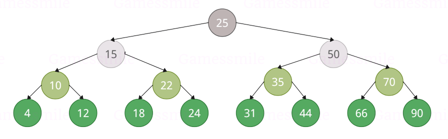

<html>
<h1>Binary Search Tree</h1>
<h6>Albero binario di Ricerca</h6> 

<h4>Il BST é una struttura dati binaria, si tratta di un grafo aciclico, connesso e dove é possibile riconoscerne una radice, un albero sostanzialmente. L'ordine in cui i vari nodi (o vertici) sono disposti, é scelto in baso al valore che essi hanno, il nodo genitore deve avere come figlio sinistro un nodo con un valore piú piccolo, mentre come figlio destro un nodo con un valore piú grande.</h4>

<h3>Le funzione presenti nel codice:</h3>
<h3 align="left">●isEmpty(), funzione che va a ritornare TRUE o FALSE, dipendentemente se esiste o meno una radice.

●insert(), va a inserire un nuovo nodo (e il relativo valore).

●remove(), va a rimuovere un nodo.

●visit(), va a stampare il nodo in input.

●PreOrder(), PostOrder(), InOrder(), sono tute e 3 le relative visite che sfruttano la funzione visit per andare a stampare il bst nel modo corretto.

●min(), max(), vanno a stampare il nodo con il valore rispettivamente minimo e massimo presenti all'interno del bst.

●search(), una funzione che va a ritornare un nodo partendo dal valore.
</h3>

●succesor(), una funzione che va a ritornare il nodo con il valore successivo a quello del nodo attuale.
</h3>

<h3>Immagine raffigurante il BST utilizzato nel main del codice</h>

</html>

<h4 align="left"><i>Author: Gamessmile</i></h4>
<h3 align="right">My Socials</h3>

